# DataMac - Math Practice Game

A modern, interactive math practice game built with Next.js and Supabase. Practice addition, subtraction, multiplication, and division with customizable difficulty ranges and real-time scoring.

## 🎯 Features

- **Customizable Operations**: Enable/disable addition, subtraction, multiplication, and division
- **Flexible Difficulty**: Set custom number ranges for each operation
- **Timer-based Sessions**: Practice with time limits (30-300 seconds)
- **Real-time Scoring**: Track your performance as you play
- **Leaderboard**: Compare scores with other players
- **Google Authentication**: Secure login with Supabase Auth

## 🏗️ Architecture


## 🔄 User Flow

```mermaid
flowchart TD
    A[Visit DataMac] --> B[Sign in with Google]
    B --> C[Configure Game Settings]
    C --> D[Select Operations: +, -, ×, ÷]
    D --> E[Set Number Ranges]
    E --> F[Choose Duration]
    F --> G[Start Game]
    G --> H[Generate Math Problem]
    H --> I[User Enters Answer]
    I --> J{Correct Answer?}
    J -->|Yes| K[Score +1]
    J -->|No| L[Score +0]
    K --> M[Next Problem]
    L --> M
    M --> N{Time Remaining?}
    N -->|Yes| H
    N -->|No| O[Game Over]
    O --> P[Save Score to Database]
    P --> Q[Display Final Score]
    Q --> R[Show Leaderboard]
    R --> S[Play Again or Configure]
```



## 🎮 Game Logic

```mermaid
graph LR
    subgraph "Problem Generation"
        A[Select Random Operation] --> B{Operation Type?}
        B -->|Addition| C[Generate: a + b = ?]
        B -->|Subtraction| D[Generate: a - b = ?]
        B -->|Multiplication| E[Generate: a × b = ?]
        B -->|Division| F[Generate: a ÷ b = ?]
    end

    subgraph "Answer Validation"
        G[User Input] --> H[Parse Number]
        H --> I[Compare with Expected]
        I --> J{Match?}
        J -->|Yes| K[Correct +1 Point]
        J -->|No| L[Incorrect +0 Points]
    end
```



## 🛠️ Tech Stack

- **Frontend**: Next.js 15, React 19, TypeScript
- **Styling**: Tailwind CSS
- **Backend**: Supabase (PostgreSQL + Auth)
- **Authentication**: Google OAuth via Supabase
- **Deployment**: Vercel (recommended)

## 🚀 Getting Started

### Prerequisites

- Node.js 18+
- Supabase account
- Google OAuth credentials

### Installation

1. **Clone the repository**

   ```bash
   git clone https://github.com/yourusername/datamac.git
   cd datamac
   ```

2. **Install dependencies**

   ```bash
   npm install
   ```

3. **Set up environment variables**
   Create a `.env.local` file:

   ```env
   NEXT_PUBLIC_SUPABASE_URL=your_supabase_project_url
   NEXT_PUBLIC_SUPABASE_ANON_KEY=your_supabase_anon_key
   ```

4. **Configure Supabase**

   - Create a new Supabase project
   - Set up Google OAuth in Authentication settings
   - Create a `scores` table with columns:
     - `id` (uuid, primary key)
     - `user_id` (uuid, foreign key to auth.users)
     - `value` (integer)
     - `created_at` (timestamp)

5. **Run the development server**

   ```bash
   npm run dev
   ```

6. **Open your browser**
   Navigate to [http://localhost:3000](http://localhost:3000)

## 📊 Database Schema


## 🎯 Game Configuration

The game supports flexible configuration for each mathematical operation:

- **Addition**: Custom ranges for both operands
- **Subtraction**: Addition problems in reverse
- **Multiplication**: Custom ranges for factors
- **Division**: Multiplication problems in reverse

## 🤝 Contributing

1. Fork the repository
2. Create a feature branch (`git checkout -b feature/amazing-feature`)
3. Commit your changes (`git commit -m 'Add amazing feature'`)
4. Push to the branch (`git push origin feature/amazing-feature`)
5. Open a Pull Request

## 📝 License

This project is licensed under the MIT License - see the [LICENSE](LICENSE) file for details.

## 🙏 Acknowledgments

- Built with [Next.js](https://nextjs.org/)
- Styled with [Tailwind CSS](https://tailwindcss.com/)
- Backend powered by [Supabase](https://supabase.com/)
- Icons from [Heroicons](https://heroicons.com/)
